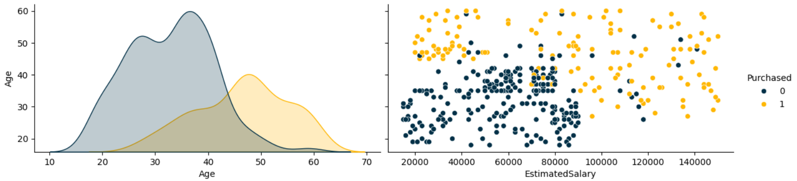
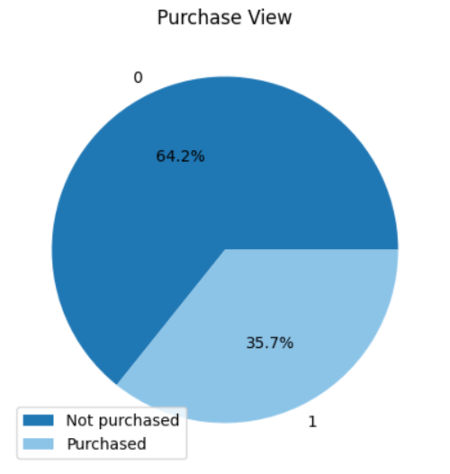
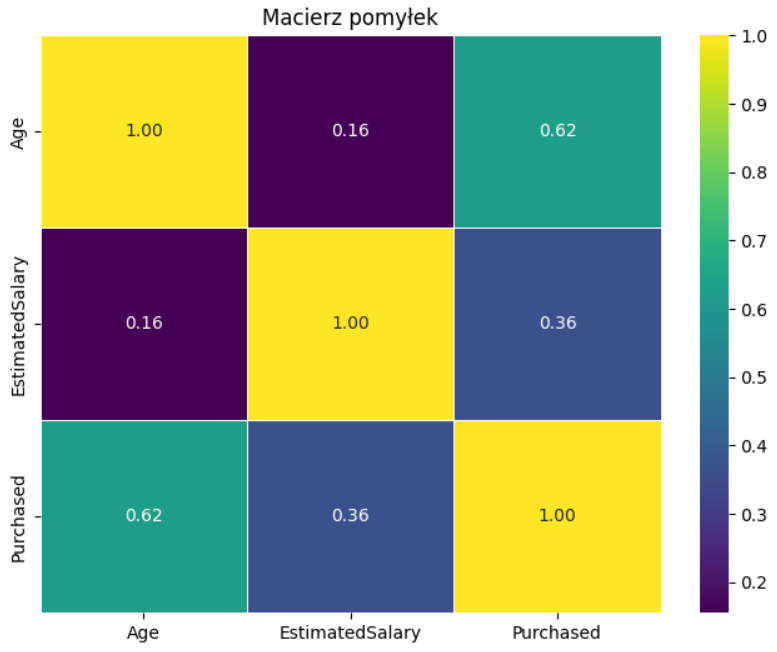
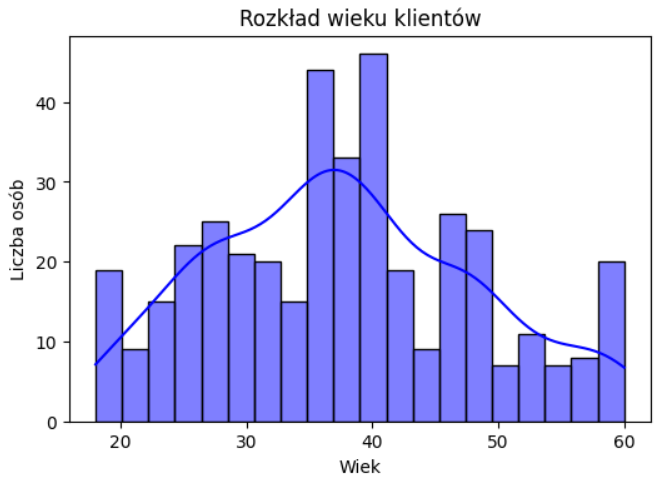
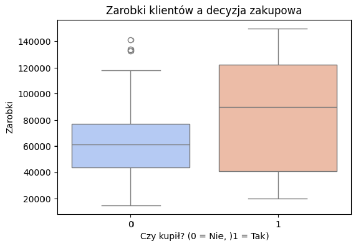
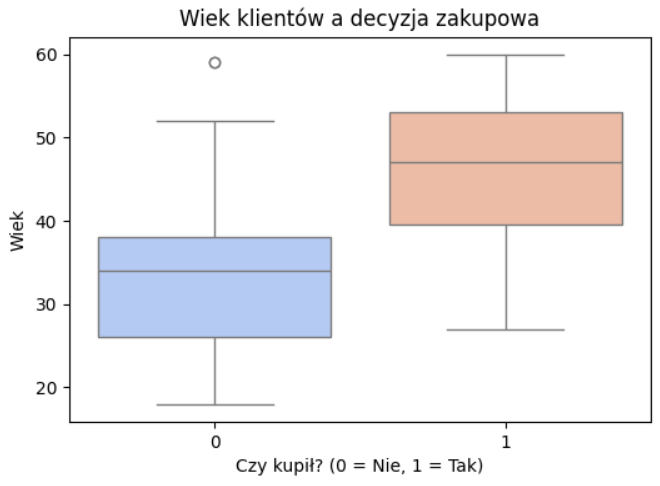
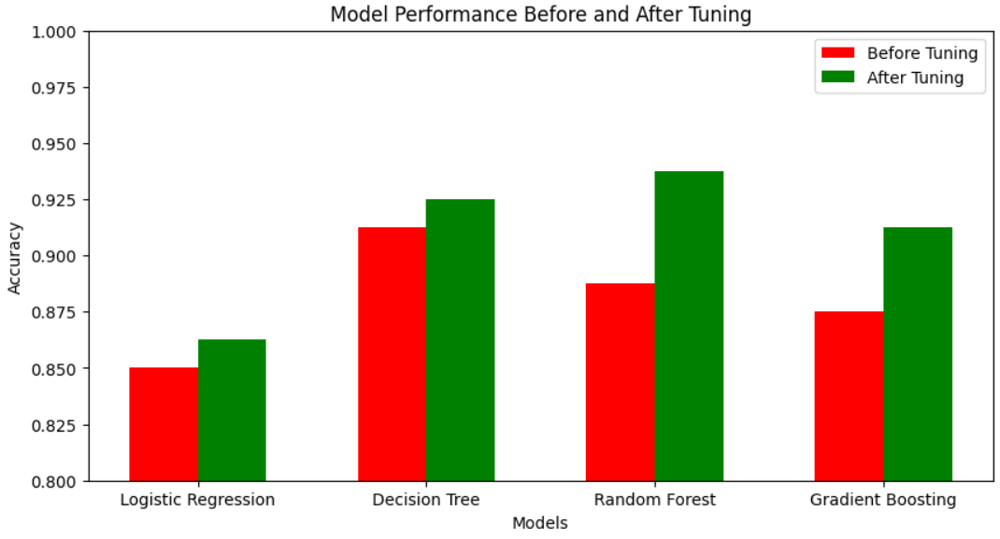

# Consumer-Buying-Behaviour---ML-EDA
 Overview

This project analyzes consumer purchasing behavior using machine learning techniques and exploratory data analysis (EDA). Various classification models were applied, including Logistic Regression, Decision Tree, Random Forest, and Gradient Boosting. After hyperparameter tuning, the best-performing model was Random Forest with an accuracy of 93.75%.

# Dataset
[dataset link](https://www.kaggle.com/datasets/sakshisatre/social-advertisement-dataset/data)
The dataset consists of the following features:

Age: The age of the customer.

EstimatedSalary: The estimated annual salary of the customer.

Purchased: The target variable indicating whether the customer made a purchase (0 = No, 1 = Yes).

# Exploratory Data Analysis (EDA)

EDA was performed to better understand the dataset:

1. Estimated Salary vs. Age Distribution

  

The left graph shows the distribution of customer ages, while the right scatter plot visualizes customer salaries versus age, highlighting those who made a purchase (yellow) and those who didn't (blue).

2. Purchase Distribution Pie Chart

  

This pie chart shows the proportion of customers who purchased the product versus those who didn't. About 35.7% of users made a purchase.

3. Correlation Heatmap

  

This heatmap illustrates the correlation between features. Age and estimated salary have a moderate impact on purchasing decisions, but the strongest correlation is observed between Purchased and Age.

4. Age Distribution of Customers

  

This histogram shows the distribution of customer ages. The majority of customers fall between 20 and 50 years old.

5. Salary vs. Purchase Decision

  

This boxplot compares estimated salary between customers who purchased and those who didn’t. People with higher salaries tend to purchase more often.

6. Age vs. Purchase Decision

  

This boxplot shows that older customers (40+) are more likely to make a purchase, while younger ones are less likely to buy.

# Machine Learning Models Implementation

The following models were trained and evaluated to determine the best-performing classifier:

Logistic Regression

Decision Tree Classifier

Random Forest Classifier

Gradient Boosting Classifier

# Model Performance Before & After Hyperparameter Tuning
   
 

This bar chart compares the accuracy of different models before and after hyperparameter tuning. The Random Forest Classifier achieved the highest accuracy of ***93.75% after tuning. Each model was first trained with default hyperparameters, and then optimized using GridSearchCV for hyperparameter tuning. Below is a summary of the accuracy before and after tuning:

**Logistic Regression

85.00% (before)

86.25% (after) 

**Decision Tree

91.25% (before)

92.50% (after)

**Random Forest

88.75% (before)

93.75% (after)

Gradient Boosting

87.50% (before)

91.25% (after)

***The best model after tuning was Random Forest Classifier, achieving an accuracy of ***93.75%.

# Technologies Used

Python (for data processing and model training)

scikit-learn (for implementing machine learning algorithms)

pandas & NumPy (for data manipulation)

matplotlib & seaborn (for data visualization)

GridSearchCV (for hyperparameter tuning)

# Next Steps

Improve feature engineering to enhance model performance.

Experiment with deep learning models (e.g., Neural Networks) for better accuracy.

Deploy the trained model using Flask or FastAPI for real-world application.
